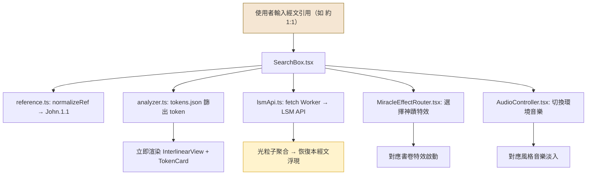

# Design Spec: GitHub Pages 聖經恢復本原文字義解析 — 靜態前端

**日期：** 2026-05-06
**狀態：** approved
**技術棧：** Astro 5 + React 19 Islands + D3.js 7 + Motion + Howler.js + Web Audio API

---

## 1. 目標

將現有 FastAPI 後端的功能網頁化，部署為 GitHub Pages 純靜態網站。

- 靜態資料（token、lexicon、書卷表、分析碼圖例）嵌入為 JSON
- 純計算邏輯（經文引用解析、Strong's 正規化、分析碼展開、注音轉換）以 TypeScript 在瀏覽器端實作
- 恢復本經文由前端直接呼叫 LSM API（`https://api.lsm.org/recver/txo.php`，已確認支援 CORS `Access-Control-Allow-Origin: *`）
- 12 種視覺特效 + 環境音樂系統
- OKLCH 暖色系 + 動態字體大小 + 響應式佈局
- SEO/AEO 優化（結構化資料、預渲染靜態 HTML）

**目前資料範圍：** 現有種子資料涵蓋 10 筆 token + 8 筆 lexicon + 30 卷書。此為 MVP 階段，功能邏輯 100% 完整實作，但搜尋/統計等功能的實用性會隨資料量擴充而提升。資料擴充計畫見第 18 節。

---

## 2. 技術棧

| 層 | 技術 | 版本 | 用途 |
|---|---|---|---|
| 靜態生成 | Astro | 5.x | Islands 架構，預渲染靜態 HTML |
| 互動 Islands | React | 19.x | 搜尋、查經結果、動態 UI |
| 視覺化 | D3.js | 7.x | 詞頻圖、分析碼分佈、經節網絡 |
| 動畫 | Motion（原 Framer Motion） | 12.x | 神蹟特效、過場動畫，import from `motion/react` |
| 粒子 | tsparticles | 3.x | 光粒子聚合文字 |
| Lottie 動畫 | lottie-react | 2.x | 鴿子降臨等精細動畫 |
| 音效引擎 | Howler.js | 2.x | 環境音樂播放、淡入淡出 |
| 程序化音效 | Web Audio API 原生 | — | 翻頁聲、鐘聲等即時生成（不用 Tone.js，減少 130KB） |
| 樣式 | CSS Modules + OKLCH | — | 暖色系 design tokens |
| 字體 | Noto Serif/Sans TC + Ezra SIL/GentiumPlus | Google Fonts + self-host | 中文/原文閱讀 |
| LSM API | 直接呼叫 | — | LSM API 支援 CORS，無需代理 |
| 部署 | GitHub Actions | — | 自動 build & deploy 到 GitHub Pages |

---

## 3. 專案結構

```
bible-recovery-analyzer/              (現有 repo 根目錄)
├── bible_recovery_analyzer/           (現有 FastAPI 後端，不動)
├── docs/superpowers/specs/            (設計文件)
└── web/                               (新增：Astro 前端專案)
    ├── astro.config.mjs
    ├── package.json
    ├── tsconfig.json
    ├── public/
    │   ├── audio/                     (環境音樂檔案，永久保存在 repo)
    │   └── lottie/                    (Lottie 動畫 JSON)
    └── src/
        ├── layouts/
        │   └── BaseLayout.astro       (共用版面)
        ├── pages/
        │   ├── index.astro            (首頁)
        │   ├── study.astro            (研經主頁)
        │   ├── books.astro            (書卷總覽)
        │   ├── legend.astro           (分析碼圖例)
        │   ├── lexicon/
        │   │   ├── index.astro        (lexicon 列表)
        │   │   └── [id].astro         (個別 Strong's 頁，僅現有 8 筆)
        │   └── resources.astro        (事工資源索引)
        ├── components/
        │   ├── islands/               (React Islands)
        │   └── static/                (Astro 純靜態元件)
        ├── data/                      (建置時靜態 JSON)
        ├── effects/                   (視覺特效模組)
        ├── audio/                     (音樂控制模組，含 Web Audio API 封裝)
        ├── lib/                       (移植自 Python 的純 TS 邏輯)
        └── styles/
            ├── tokens.css             (OKLCH design tokens)
            └── global.css
```

---

## 4. 頁面路由

| 路由 | 頁面 | 預渲染 | React Islands |
|------|------|--------|---------------|
| `/` | 首頁（古卷展開 + 搜尋框） | 是 | SearchBox, ScrollUnfold |
| `/study` | 研經主頁 | 是（殼） | VerseResult, Interlinear, D3Charts, TokenCards |
| `/books` | 書卷總覽 | 是 | 無（純靜態表格） |
| `/legend` | 分析碼圖例 | 是 | 無（純靜態） |
| `/lexicon` | Lexicon 列表 | 是 | SearchFilter |
| `/lexicon/[id]` | 個別 Strong's 頁（現有 8 筆：H430, H1961, H7225, G3056, G2316, G2064, G3756, G3361） | 是 | D3OccurrenceChart |
| `/resources` | 事工資源索引 | 是 | 無（純靜態） |

---

## 5. 功能對照表（FastAPI → 前端）

| # | FastAPI 端點 | 前端實作方式 | 資料來源 |
|---|---|---|---|
| 1 | `/verse` | SearchBox → VerseResult 元件 | tokens.json + LSM API (via Worker) |
| 2 | `/passage` | SearchBox → PassageResult 元件（多節） | tokens.json + LSM API (via Worker) |
| 3 | `/interlinear` | InterlinearView 元件（四行對照） | tokens.json + LSM API (via Worker) |
| 4 | `/word` | SearchBox（模式切換：字詞搜尋） | tokens.json 本地篩選 |
| 5 | `/strongs/{id}` | `/lexicon/[id]` 預渲染頁面 | lexicon.json |
| 6 | `/lemma` | SearchBox（模式切換：lemma 搜尋） | tokens.json 本地篩選 |
| 7 | `/search` | SearchBox（全文搜尋模式） | tokens.json 跨欄位搜尋 |
| 8 | `/codes/{code}` | 分析碼點擊展開（inline） | analyticalCodes.json |
| 9 | `/morphology/search` | SearchBox（詞形搜尋模式） | tokens.json 本地篩選 |
| 10 | `/legend` | `/legend` 靜態頁面 | analyticalCodes.json + bookMap.json |
| 11 | `/books` | `/books` 靜態頁面 | bookMap.json |
| 12 | `/resources` | `/resources` 靜態頁面 | 硬編碼資源列表 |
| 13 | `/study` | `/study` 研經主頁（聚合所有元件） | 全部資料來源 |
| 14 | `/health` | 不需要（靜態站無後端） | — |
| 15 | `/provider-status` | 不需要（前端直呼 LSM） | — |

---

## 6. React Islands 元件清單

### 6.1 核心互動元件

| 元件 | 檔案 | hydrate 策略 | 功能 |
|------|------|-------------|------|
| SearchBox | `islands/SearchBox.tsx` | `client:load` | 搜尋框 + 經文引用解析 + 搜尋模式切換 |
| VerseResult | `islands/VerseResult.tsx` | `client:load` | 單節經文結果卡片 |
| PassageResult | `islands/PassageResult.tsx` | `client:load` | 段落經文結果（多節） |
| InterlinearView | `islands/InterlinearView.tsx` | `client:load` | 逐字對照四行顯示 |
| TokenCard | `islands/TokenCard.tsx` | `client:visible` | 原文字詞研究卡（23 欄位，對應 TokenStudy schema） |
| LexiconDetail | `islands/LexiconDetail.tsx` | `client:visible` | Strong's 詳情展開 |
| SearchFilter | `islands/SearchFilter.tsx` | `client:load` | Lexicon 列表頁篩選器 |
| FontSizeControl | `islands/FontSizeControl.tsx` | `client:load` | 字體大小 A / A+ / A++ 三段切換 |
| AudioController | `islands/AudioController.tsx` | `client:load` | 音樂開關 + 音量 + M 鍵快捷 |
| ThemeToggle | `islands/ThemeToggle.tsx` | `client:load` | 亮色/深色模式手動切換 |

### 6.2 D3 視覺化元件

| 元件 | 檔案 | hydrate 策略 | 功能 |
|------|------|-------------|------|
| LemmaFrequencyChart | `islands/LemmaFrequencyChart.tsx` | `client:idle` | lemma 出現頻率長條圖 |
| AnalyticalCodePie | `islands/AnalyticalCodePie.tsx` | `client:idle` | 分析碼分佈圓餅圖 |
| RelatedVersesNetwork | `islands/RelatedVersesNetwork.tsx` | `client:idle` | 相關經節網絡圖 |
| D3OccurrenceChart | `islands/D3OccurrenceChart.tsx` | `client:visible` | Strong's 頁出現統計 |

### 6.3 視覺特效元件

| 元件 | 檔案 | hydrate 策略 | 功能 |
|------|------|-------------|------|
| ScrollUnfold | `effects/ScrollUnfold.tsx` | CSS 第一階段 + `client:load` 第二階段 | #1 古卷展開 |
| ParticleText | `effects/ParticleText.tsx` | `client:idle` Tier 1 | #2 光粒子聚合文字 |
| LivingWaterLoader | `effects/LivingWaterLoader.tsx` | 純 CSS + `client:idle` | #3 活水流動進度條 |
| GenesisLight | `effects/GenesisLight.tsx` | `client:visible` Tier 2 | #4 創世之光 |
| PartingWaters | `effects/PartingWaters.tsx` | `client:visible` Tier 2 | #5 紅海分開 |
| PentecostFlames | `effects/PentecostFlames.tsx` | `client:visible` Tier 2 | #6 五旬節火焰 |
| ResurrectionQuake | `effects/ResurrectionQuake.tsx` | `client:visible` Tier 2 | #7 復活震動 |
| TreeOfLife | `effects/TreeOfLife.tsx` | `client:visible` Tier 2 | #8 生命樹生長 |
| CosmicFirmament | `effects/CosmicFirmament.tsx` | `client:visible` Tier 2 | #9 星空穹蒼 |
| DoveDescending | `effects/DoveDescending.tsx` | `client:visible` Tier 2 | #10 鴿子降臨 |
| MiracleEffectRouter | `effects/MiracleEffectRouter.tsx` | `client:idle` | 根據書卷/lemma 自動選擇特效 |

**Tier 2 特效改用 `client:visible`**（而非 `client:idle`），確保只在使用者實際看到時才初始化，避免多個特效同時初始化造成 jank。

### 6.4 Astro 純靜態元件（零 JS）

| 元件 | 檔案 | 功能 |
|------|------|------|
| Header | `static/Header.astro` | 導覽列 + FontSizeControl + AudioController + ThemeToggle 插槽 |
| Footer | `static/Footer.astro` | Attribution + 版權聲明 |
| BookGrid | `static/BookGrid.astro` | 書卷快速入口格子 |
| LegendTable | `static/LegendTable.astro` | 分析碼圖例表格 |
| ResourceList | `static/ResourceList.astro` | 事工資源列表 |
| SkeletonCard | `static/SkeletonCard.astro` | 骨架屏（純 CSS 脈動動畫） |

---

## 7. 資料層

### 7.1 靜態 JSON（build 時產生）

| 檔案 | 來源 | 內容 |
|------|------|------|
| `data/tokens.json` | `seed_data.py` SAMPLE_TOKENS | 10 筆 token，含全部 23 欄位（MVP 資料） |
| `data/lexicon.json` | `seed_data.py` LEXICON | 8 筆 lexicon 條目（MVP 資料） |
| `data/bookMap.json` | `book_map.py` BOOK_ROWS | 30 卷書對照表 + 別名（MVP，缺 36 卷舊約） |
| `data/analyticalCodes.json` | `analytical_codes.py` | 分析碼圖例 + 縮寫圖例 + 文法注記（合併為單一檔案） |

### 7.2 移植自 Python 的 TypeScript 模組

| 模組 | Python 來源 | 功能 |
|------|------------|------|
| `lib/reference.ts` | `services/reference.py` | `normalizeRef()` + `splitOsisRange()` |
| `lib/strongs.ts` | `services/strongs.py` | `normalizeStrongs()` |
| `lib/analyticalCodes.ts` | `services/analytical_codes.py` | `parseAnalyticalCode()` |
| `lib/pronunciation.ts` | `services/pronunciation.py` | `transliterationToZhuyinLike()` |
| `lib/analyzer.ts` | `services/analyzer.py` | 本地 token/lexicon 查詢（操作 JSON 而非 SQLite） |
| `lib/search.ts` | `services/analyzer.py` search() | 全文跨欄位搜尋 |
| `lib/lsmApi.ts` | `services/recovery/providers.py` | 直接呼叫 LSM API（已確認支援 CORS） |

### 7.3 LSM API 呼叫（前端直接呼叫）

LSM API 已確認支援 CORS（回傳 `Access-Control-Allow-Origin: *`），前端可直接呼叫，無需代理。

```typescript
// lib/lsmApi.ts
const LSM_API_URL = "https://api.lsm.org/recver/txo.php";

export async function fetchRecoveryText(ref: string): Promise<RecoveryResult> {
  const params = new URLSearchParams({ String: ref, Out: "json" });
  const resp = await fetch(`${LSM_API_URL}?${params}`);
  const data = await resp.json();
  // 解析 data.verses / data.text / data.copyright
  // 禁止使用 dangerouslySetInnerHTML 渲染回傳內容
  // 所有外部 API 回傳文字一律透過 React JSX 自動 escape 或 DOMPurify 清洗
}
```

**錯誤降級：**
- LSM API 失敗 → 顯示友善錯誤訊息卡片（「恢復本經文暫時無法載入，請稍後再試」）
- 本地 token 資料不受影響，interlinear 和 token card 仍可正常顯示
- 重試策略：自動重試 1 次（間隔 2 秒），失敗後停止

---

## 8. 神蹟特效系統

### 8.1 特效清單

| # | 名稱 | 觸發條件 | 技術 |
|---|------|---------|------|
| 1 | 古卷展開 | 首頁載入 | CSS clip-path + Motion (`motion/react`) |
| 2 | 光粒子聚合文字 | 所有搜尋結果出現 | tsparticles / Canvas 2D |
| 3 | 活水流動進度條 | 所有載入等待狀態 | SVG path + CSS stroke-dashoffset |
| 4 | 創世之光 | book === "Gen" | CSS radial-gradient + mix-blend-mode |
| 5 | 紅海分開 | book === "Exod" | Motion + SVG feTurbulence |
| 6 | 五旬節火焰 | book === "Acts" 或 lemma 含 pneuma | CSS @keyframes + filter: blur |
| 7 | 復活震動 | Matt.28, Mark.16, Luke.24, John.20 | CSS transform + Motion 序列 |
| 8 | 生命樹生長 | book === "Rev" 或 "Gen" | D3 遞迴樹 + SVG stroke-dasharray |
| 9 | 星空穹蒼 | book === "Ps" 或 "Gen" | Canvas 粒子 + requestAnimationFrame |
| 10 | 鴿子降臨 | lemma 含 pneuma 或特定洗禮經節 | Lottie 動畫 或 SVG path morph |
| 11 | 環境氛圍音樂 | 使用者首次點擊互動元素觸發 | Howler.js |
| 12 | 程序化生成音效 | 翻頁/搜尋完成/捲動 | Web Audio API 原生 |

### 8.2 觸發規則

```typescript
const EFFECT_RULES = [
  // 書卷級（僅匹配 bookMap 中現有的書卷）
  { match: (ctx) => ctx.book === "Gen",  effect: "genesis-light" },
  { match: (ctx) => ctx.book === "Gen",  effect: "cosmic-firmament" },
  { match: (ctx) => ctx.book === "Exod", effect: "parting-waters" },
  { match: (ctx) => ctx.book === "Ps",   effect: "cosmic-firmament" },
  { match: (ctx) => ctx.book === "Acts", effect: "pentecost-flames" },
  { match: (ctx) => ctx.book === "Rev",  effect: "tree-of-life" },

  // 章節級
  { match: (ctx) => ["Matt.28","Mark.16","Luke.24","John.20"]
      .some(p => ctx.ref.startsWith(p)), effect: "resurrection-quake" },

  // 語義級（使用 normalized_form 比對，不含重音）
  { match: (ctx) => ctx.normalizedForms.includes("\u03C0\u03BD\u03B5\u03C5\u03BC\u03B1"), effect: "dove-descending" },
  { match: (ctx) => ctx.normalizedForms.includes("\u03C0\u03BD\u03B5\u03C5\u03BC\u03B1"), effect: "pentecost-flames" },

  // 預設：所有經文都有光粒子聚合
  { match: () => true, effect: "particle-text" },
];
```

### 8.3 無障礙

- `prefers-reduced-motion: reduce` 時關閉所有粒子、震動、火焰特效，僅保留淡入淡出
- 手機端：粒子數量降為桌面 1/3；如偵測到 FPS < 30 則自動關閉粒子特效

---

## 9. 音效系統

### 9.1 環境音樂對照

| 書卷類型 | 音樂風格 | 情境 |
|---------|---------|------|
| 摩西五經（Gen, Exod 等已有書卷） | 中東風格弦樂 + 沙漠風聲 | 曠野、西乃山 |
| 詩篇 | 豎琴/里拉琴獨奏 | 大衛的詩歌 |
| 福音書（Matt-John） | 溫暖的弦樂四重奏 | 耶穌的腳蹤 |
| 書信（Rom-Jude） | 安靜鋼琴 | 默想、研讀 |
| 啟示錄 | 管風琴 + 天堂合唱 pad | 榮耀、終末 |
| 預設（未分類書卷） | 安靜鋼琴 | 通用研經 |

### 9.2 音源

- **Pixabay Music**（免費商用、免標注）— 首選
- **Musopen**（古典樂公有領域錄音）
- 所有選用的音檔**永久保存在 `public/audio/`** 目錄中，不依賴外部連結

### 9.3 程序化音效（Web Audio API 原生實作）

| 互動 | 音效 | 實作 |
|------|------|------|
| 翻頁/切換書卷 | 輕柔紙張聲 | AudioContext + white noise + BiquadFilter |
| 搜尋完成 | 清脆鐘聲一響 | AudioContext + OscillatorNode (sine wave decay) |
| 捲動經文 | 若有似無的環境 pad | AudioContext + GainNode fade |

使用原生 Web Audio API 而非 Tone.js，避免增加 ~130KB gzip 的首屏負擔。封裝為 `audio/webAudioEffects.ts`（預估 < 3KB）。

### 9.4 音效策略

- **預設開啟**：使用者首次點擊搜尋框或任何互動元素時順勢播放
- **首次互動 toast**：顯示「環境音樂已開啟，可隨時按右上角按鈕或 M 鍵靜音」（3 秒後自動消失）
- **靜音控制**：右上角按鈕 + `M` 鍵快捷鍵
- **記憶偏好**：靜音狀態寫入 `localStorage`，下次造訪若有靜音記錄則保持靜音
- **螢幕閱讀器**：靜音按鈕加 `aria-label="靜音環境音樂"`，音樂狀態變更時用 `aria-live="polite"` 通知
- **載入策略**：Howler.js 與 SearchBox 打包在同一 island chunk（`client:load`）；Web Audio API 封裝 (`webAudioEffects.ts`) 極小，一併載入；音檔使用 `<link rel="prefetch">` 提前抓取，點擊時串流播放

---

## 10. OKLCH Design Tokens

### 10.1 亮色模式

```css
:root {
  /* 主色系（暖棕） */
  --color-primary:        oklch(0.45 0.10 55);
  --color-primary-hover:  oklch(0.40 0.12 55);
  --color-primary-light:  oklch(0.75 0.08 55);

  /* 強調色（琥珀金） */
  --color-accent:         oklch(0.70 0.16 70);
  --color-accent-hover:   oklch(0.65 0.18 70);
  --color-accent-glow:    oklch(0.80 0.12 70);

  /* 語義色 */
  --color-hebrew:         oklch(0.60 0.14 40);
  --color-greek:          oklch(0.55 0.12 250);
  --color-recovery:       oklch(0.50 0.10 150);

  /* 表面/背景 */
  --color-bg:             oklch(0.98 0.005 80);
  --color-surface:        oklch(0.96 0.01 75);
  --color-surface-hover:  oklch(0.93 0.015 75);
  --color-border:         oklch(0.88 0.02 70);

  /* 文字（text + text-secondary 滿足 WCAG AA >= 4.5:1；muted 僅用於大字/非必要文字，滿足 AA Large Text >= 3:1） */
  --color-text:           oklch(0.22 0.03 50);
  --color-text-secondary: oklch(0.40 0.03 55);
  --color-text-muted:     oklch(0.48 0.02 55);
  /* 注意：--color-accent 不可用於小號正文文字，僅用於按鈕/連結/大標題 */

  /* 特效專用 */
  --color-flame-core:     oklch(0.75 0.20 60);
  --color-flame-outer:    oklch(0.65 0.22 40);
  --color-water:          oklch(0.65 0.10 230);
  --color-light-burst:    oklch(0.95 0.08 90);
  --color-star:           oklch(0.90 0.10 85);
  --color-particle:       oklch(0.85 0.12 75);
}
```

### 10.2 深色模式

支援自動偵測（`prefers-color-scheme`）+ 手動切換（ThemeToggle 元件）。使用者手動選擇的偏好存入 `localStorage`，優先於系統設定。

```css
[data-theme="dark"] {
  /* 表面/背景 */
  --color-bg:             oklch(0.18 0.01 50);
  --color-surface:        oklch(0.22 0.015 50);
  --color-surface-hover:  oklch(0.27 0.02 50);
  --color-border:         oklch(0.32 0.02 55);

  /* 文字 */
  --color-text:           oklch(0.90 0.02 70);
  --color-text-secondary: oklch(0.72 0.02 65);
  --color-text-muted:     oklch(0.63 0.015 60);

  /* 主色系（深色模式亮度調高） */
  --color-primary:        oklch(0.65 0.10 55);
  --color-primary-hover:  oklch(0.60 0.12 55);
  --color-primary-light:  oklch(0.45 0.08 55);

  /* 強調色 */
  --color-accent:         oklch(0.75 0.16 70);
  --color-accent-hover:   oklch(0.70 0.18 70);
  --color-accent-glow:    oklch(0.85 0.12 70);

  /* 語義色（深色背景上調亮） */
  --color-hebrew:         oklch(0.70 0.14 40);
  --color-greek:          oklch(0.65 0.12 250);
  --color-recovery:       oklch(0.60 0.10 150);

  /* 特效色（深色模式下更醒目） */
  --color-particle:       oklch(0.90 0.15 75);
  --color-flame-core:     oklch(0.80 0.22 60);
  --color-flame-outer:    oklch(0.70 0.22 40);
  --color-light-burst:    oklch(0.98 0.10 90);
  --color-water:          oklch(0.70 0.12 230);
  --color-star:           oklch(0.92 0.12 85);
}
```

---

## 11. 字體系統

### 11.1 字體選擇

| 用途 | 字體 | 來源 | 授權 |
|------|------|------|------|
| 經文/正文 | Noto Serif TC, Source Han Serif TC | Google Fonts CDN | OFL |
| UI/按鈕 | Noto Sans TC, Source Han Sans TC | Google Fonts CDN | OFL |
| 希伯來文 | Ezra SIL, Noto Sans Hebrew | self-host woff2 (~50KB) | SIL OFL |
| 希臘文 | GentiumPlus, Noto Sans Greek | self-host woff2 (~50KB) | SIL OFL |
| 等寬（分析碼） | JetBrains Mono, Fira Code | Google Fonts CDN | OFL / Apache 2.0 |

**注意：** 不使用 SBL Hebrew / SBL Greek，因其授權不明確允許 web embedding。Ezra SIL 和 GentiumPlus 同為學術級品質，且為 SIL Open Font License，可自由 web 嵌入。

### 11.2 動態字體大小

```css
:root {
  --font-size-scale: 1;
  --font-xs:       calc(14px * var(--font-size-scale));
  --font-sm:       calc(16px * var(--font-size-scale));
  --font-base:     calc(20px * var(--font-size-scale));
  --font-lg:       calc(24px * var(--font-size-scale));
  --font-xl:       calc(30px * var(--font-size-scale));
  --font-2xl:      calc(36px * var(--font-size-scale));
  --font-original: calc(24px * var(--font-size-scale));
  --line-height:   calc(1.6 + 0.1 * (var(--font-size-scale) - 1));
}

[data-font-scale="1"]   { --font-size-scale: 1; }
[data-font-scale="1.3"] { --font-size-scale: 1.3; }
[data-font-scale="1.6"] { --font-size-scale: 1.6; }
```

三段切換（標準 / 大 / 特大），偏好存 `localStorage`。

---

## 12. 響應式佈局

### 12.1 斷點

| 斷點 | 佈局 |
|------|------|
| >= 1024px（桌面） | 雙欄：左側搜尋+結果，右側側邊欄（書卷跳轉、最近查詢、D3 圖表） |
| 768-1023px（平板） | 單欄全寬，D3 圖表折疊可展開 |
| < 768px（手機） | 單欄 + sticky 搜尋框 + 底部導覽列 |

### 12.2 手機專屬優化

| 項目 | 做法 |
|------|------|
| Interlinear 對照 | 水平滑動，不折行 |
| Token 卡片 | 預設折疊（surface_form + gloss），點擊展開完整 23 欄 |
| D3 圖表 | `client:media="(min-width: 768px)"` 手機不載入，改用純文字統計 |
| 神蹟特效 | 粒子數量降為桌面 1/3；FPS < 30 時自動關閉 |
| 音樂 | 同桌面，不降級 |
| 導覽 | 底部固定 4 tab：首頁 / 書卷 / 圖例 / 設定 |

---

## 13. 效能載入策略

### 13.1 分層載入

| 階段 | 時間 | 內容 | 大小（gzip） | 策略 |
|------|------|------|-------------|------|
| 0ms | HTML 到達 | 靜態內容立即顯示 | ~15KB | 預渲染 HTML |
| 50ms | CSS 動畫 | 古卷展開第一階段、骨架屏脈動 | — | 純 CSS @keyframes |
| ~300ms | 核心 JS | SearchBox + Howler.js + Web Audio 封裝 + React | ~70KB | `client:load` |
| idle | Tier 1 特效 | 光粒子系統 (tsparticles core)、活水動畫 | ~20KB | `client:idle` |
| visible | Tier 2 特效 | 火焰、紅海、震動、星空、鴿子、生命樹 | ~35KB | `client:visible` |
| visible | D3 圖表 | 詞頻、分析碼分佈、網絡圖 | ~25KB | `client:visible` |
| user action | 音檔 | 環境音樂串流 | 按需 | 點擊觸發 fetch |

### 13.2 預載入提示

```html
<link rel="preload" href="/fonts/noto-serif-tc.woff2" as="font" type="font/woff2" crossorigin />
<link rel="modulepreload" href="/assets/islands-search.js" />
<link rel="prefetch" href="/study" />
<link rel="prefetch" href="/assets/effects-tier1.js" />
```

### 13.3 骨架屏與漸進渲染

搜尋結果載入時顯示暖色 OKLCH 脈動骨架卡片（純 CSS），本地 token 資料先渲染（不等 LSM API），LSM 回傳後光粒子聚合顯示恢復本經文。

### 13.4 效能目標

| 指標 | 目標 |
|------|------|
| FCP (First Contentful Paint) | < 1.0s |
| LCP (Largest Contentful Paint) | < 2.0s |
| TTI (Time to Interactive) | < 3.0s |
| CLS (Cumulative Layout Shift) | < 0.05 |
| 首屏 JS（`client:load` 總量） | < 75KB gzip |

### 13.5 錯誤處理

| 錯誤場景 | 使用者看到的 |
|---------|------------|
| LSM API 超時/失敗 | 恢復本經文區顯示「經文暫時無法載入」卡片 + 重試按鈕，其餘 interlinear/token card 正常 |
| Worker 代理無回應 | 同上 |
| tokens.json 載入失敗 | 全頁錯誤提示「資料載入失敗，請重新整理」 |
| 音檔載入失敗 | 靜默降級，不影響核心功能 |

---

## 14. SEO / AEO 策略

### 14.1 預渲染靜態 HTML

書卷表、分析碼圖例、lexicon 條目在 build 時生成完整 HTML。搜尋引擎直接索引內容。

### 14.2 結構化資料

每個 Strong's 頁面加入 `DefinedTerm` schema：

```json
{
  "@context": "https://schema.org",
  "@type": "DefinedTerm",
  "name": "logos",
  "description": "word, expression",
  "inDefinedTermSet": {
    "@type": "DefinedTermSet",
    "name": "Strong's Concordance"
  },
  "identifier": "G3056",
  "inLanguage": "grc"
}
```

### 14.3 Meta tags + Open Graph

每頁獨立 `<title>` 和 `<meta description>`，含原文 + 中文 + Strong's 編號。

**OG Image 策略：** 使用 `satori` 在 build time 為每個 lexicon 頁面生成 OG image（含 lemma + gloss + Strong's ID），存為靜態 PNG。首頁和功能頁使用統一的品牌 OG image。

### 14.4 國際化語言標記

```html
<!-- 頁面主語言 -->
<html lang="zh-Hant">

<!-- 希伯來文片段 -->
<span lang="he" dir="rtl">בְּרֵאשִׁית</span>

<!-- 希臘文片段 -->
<span lang="grc">λόγος</span>
```

所有 InterlinearView 和 TokenCard 中的原文片段必須加上正確的 `lang` 屬性和 `dir` 方向，影響螢幕閱讀器發音引擎和搜尋引擎語言偵測。

---

## 15. 無障礙 (A11y)

| 項目 | 做法 |
|------|------|
| 色彩對比度 | WCAG AA (>= 4.5:1)，所有 text/bg 組合需實際計算 sRGB 對比度（不僅依賴 OKLCH L 值差） |
| 鍵盤操作 | 搜尋框 Tab 到結果卡 Enter 展開，完整 focus 鏈 |
| 螢幕閱讀器 | 卡片 aria-label，D3 圖表 role="img" aria-label |
| 動畫 | prefers-reduced-motion: reduce 時關閉粒子/震動/火焰 |
| 音效 | 預設開啟，首次播放時 toast 提示，可隨時靜音（按鈕 + M 鍵），`aria-live="polite"` 通知狀態 |
| 字體 | 三段動態放大，預設 20px 偏大 |
| 語言標記 | 希伯來文 `lang="he" dir="rtl"`，希臘文 `lang="grc"` |
| XSS 防護 | 禁止對任何外部 API 回傳內容使用 `dangerouslySetInnerHTML`，一律透過 React JSX escape |

---

## 16. 部署

### 16.1 GitHub Actions（前端）

觸發條件：push 到 main 且 `web/**` 有變更。

流程：`npm ci` → `npm run build`（含 satori OG image 生成）→ deploy `web/dist/` 到 GitHub Pages。

### 16.2 Astro 配置

```javascript
// astro.config.mjs
import { defineConfig } from 'astro/config';
import react from '@astrojs/react';

export default defineConfig({
  site: 'https://<org>.github.io',
  base: '/bible-recovery-analyzer',
  integrations: [react()],
  output: 'static',
});
```

---

## 17. 資料流圖



---

## 18. 資料擴充計畫

MVP 階段使用現有種子資料（10 token + 8 lexicon + 30 卷書），功能邏輯完整但資料有限。後續擴充路線：

| 階段 | 資料目標 | 來源 | 影響 |
|------|---------|------|------|
| MVP (本次) | 10 token, 8 lexicon, 30 books | seed_data.py | 所有功能可 demo，搜尋/統計資料量有限 |
| Phase 2 | 完整 66 卷書對照表 | 補齊 book_map.py | 所有書卷輸入可解析，不再報錯 |
| Phase 3 | 全量 NT token (~140,000) | 開源 MorphGNT / SBLGNT | 搜尋/統計/D3 圖表有實用價值 |
| Phase 4 | 全量 OT token (~400,000) | 開源 OSHB / WLC | 完整 OT 覆蓋 |
| Phase 5 | 完整 Strong's lexicon (~8,700) | 開源 Strong's 資料 | 所有 Strong's ID 有獨立頁面 |

每個 Phase 獨立進行，不阻塞 MVP 上線。
