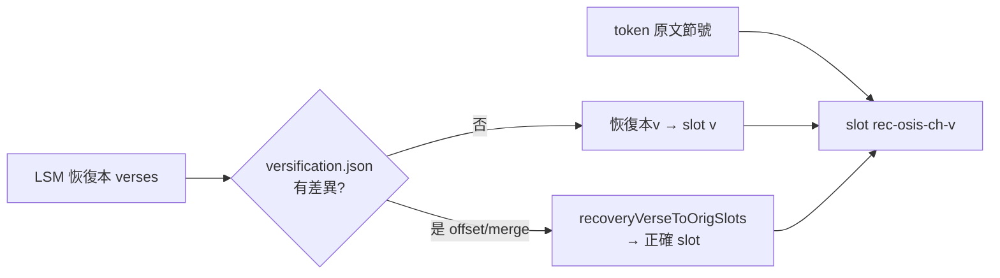

# 設計：全經節對映、聖經地圖、逐章頁聖樂

日期：2026-06-04
狀態：設計已與用戶確認，待寫實作計劃

本文涵蓋三項**彼此獨立**的功能（共用此 spec，但各自獨立實作與部署）。建議實作順序依「修 bug > 小功能 > 大功能」：**功能一（節對映，真實 bug）→ 功能三（聖樂，改動小）→ 功能二（地圖，全新最大）**。

---

## 功能一：全經節對映（修正原文↔恢復本分節錯位）

### 背景與問題

逐章頁 `study/[book]/[chapter].astro` 靜態烤入原文逐字對照，runtime 由 `ChapterRecovery` island 向 LSM 取恢復本、依**節號**填入各節 slot：

- slot id = `rec-{osis}-{ch}-{原文節號}`（由 token / OSHB·MorphGNT 的 verse_ref 產生）。
- `ChapterRecovery` 拿**恢復本回傳的節號**去找同號 slot 填入。

當原文（OSHB/MorphGNT）與恢復本的分節不一致時，兩套節號錯開，恢復本被填進錯誤的原文 slot。已實測兩種型態：

1. **詩篇希伯來題注（大宗，逾百篇）**：希伯來把題注算作正式經節，恢復本放標題不編號 → 原文比恢復本多 1–2 節。
   - 證據（Ps3）：原文 v1 = 題注「מִזְמוֹר לְדָוִד…（大衛的詩，在他逃避兒子押沙龍時）」、原文 v2 =「耶和華啊，我的敵人何其多」；恢復本 v1 =「耶和華阿，我的敵人何其多」。
   - 後果：恢復本 v1 被填進原文 v1（題注）格，整篇逐字對照與恢復本**錯開一節**，原文末節無恢復本（留空）。
   - 抽樣差異（原文→恢復本）：Ps3 9→8、Ps4 9→8、Ps5 13→12、Ps18 51→50、Ps51 21→19、Ps60 14→12；Ps23 6→6、Ps90 17→17（無題注者不差）。
2. **末節合併**：3John 原文 15 節，恢復本把原文 14+15（「我盼望見你」「願你平安」）併為第 14 節 → 原文第 15 節 slot 留空。

> 這是真實、系統性的 bug，非僅 3John 末節空格。用戶已確認**全經修**。

### 範圍

全經。差異「型態」已知（題注位移、末節合併），但**確切涉及哪些卷章需由掃描決定**——故實作第一步是掃描腳本，不靠人工枚舉。

### 設計

**A. 掃描腳本 `web/scripts/scan-versification.mjs`（一次性／可重跑）**
- 對全 66 卷 1189 章：讀本地 token 取「原文節號集合」，打 LSM（zho，沿用 `buildLsmChapterRef`）取「恢復本節號集合」，比對。
- 對每個有差異的章，推導對映規則並輸出到 `web/src/data/versification.json`。
- 依賴外部 LSM API（約 1189 請求，序列+退避），故**不放 CI**，與 `check:recovery` 同性質的手動工具。
- 輸出同時印出摘要（哪些卷章、差異型態），供人工複核。

**B. 對映資料 `web/src/data/versification.json`**
- 模型：以「位移 offset」為主、「合併特例」為輔，避免逐節枚舉膨脹。
- 形狀（示意）：
  ```jsonc
  {
    "Ps": { "3": { "type": "offset", "recToOrig": 1 },   // 恢復本 vN → 原文 v(N+1)
            "51": { "type": "offset", "recToOrig": 2 } },
    "3John": { "1": { "type": "merge", "merges": { "14": [14, 15] } } } // 恢復本14 → 原文14&15
  }
  ```
- 語意：給定「恢復本節號」回傳「應填入的原文 slot 節號（可多個）」；無此卷章 = 無差異，恢復本節號即原文節號（現行行為）。

**C. 頁面套用**
- 新增純函式 `web/src/lib/versification.ts`：`recoveryVerseToOrigSlots(osis, chapter, recVerse): number[]`，讀 `versification.json`。
- `ChapterRecovery` 填 slot 前，用此函式把恢復本節號轉成正確原文 slot（merge 情形填入多格或主格+註記）。
- **題注格處理**：被位移空出的原文 v1（題注）格，因恢復本無對應經文，改顯示說明標記「〔詩篇題注〕」（取代目前錯位的經文），不再塞錯內容。



### 測試
- **vitest（進 CI）**：`tests/lib/versification.test.ts` — 驗對映函式對 offset/merge 規則回正確 slot；驗 `versification.json` 對掃描出的每個差異章都有條目。
- **`check:recovery` 擴充**：除每卷第 1 章外，加抽驗數篇有題注詩篇（如 Ps3/Ps51）套用對映後「恢復本 v1 對到原文 v2、原文末節不空」。

### 風險
- LSM 配額（掃描 1189 章一次性）→ 序列 + 退避，可分段重跑。
- 對映模型須涵蓋所有實際型態；若掃描發現第三種型態（如中段插節），擴充 `type`。

---

## 功能二：聖經地圖（重點事件／行程，輕量互動）

### 範圍
精選 **6–8 張**重點地圖（待實作時微調）：出埃及路線、迦南分地、被擄與歸回、耶穌生平地點、保羅三次宣教旅程 + 赴羅馬、啟示錄七教會。

### 技術
- **Leaflet**（npm bundle，隨站打包，符合純靜態 GitHub Pages）。
- **底圖 = 古地圖風格圖片**：用開放授權的古地理／羊皮紙風格底圖，以 Leaflet `ImageOverlay`（`L.CRS.Simple` 像素座標）呈現 → 可縮放點選、風格莊重、**無外部 tile server 依賴**。
- 地名點／路線：JSON（座標可取自 OpenBible.info CC-BY，或就底圖像素座標自建精選點）。

### 元件與資料
- `web/src/components/islands/MapView.tsx`：Leaflet island（`client:visible`），props 指定底圖圖片與該圖的點/線資料。
- `web/src/data/maps/*.json`：每張地圖一檔（底圖尺寸、點 [label,x,y]、路線 [點序列]、說明）。
- 底圖圖片置於 `web/public/maps/*.（jpg|svg|webp）`。

### 呈現
- 獨立頁 `web/src/pages/maps/index.astro`（輿圖）列出各張地圖；可加 `maps/[slug].astro` 個別頁。
- 相關書卷頁／逐章頁可連到對應地圖（如出埃及 → 出埃及路線圖）。

### 版權
- Leaflet：BSD-2。底圖與座標：限 CC-BY / 公共領域，於頁面註明出處（沿用站上 attribution 慣例）。

### 測試
- smoke 增 gate：`/maps` 頁存在、含 MapView island 參照、底圖資產存在、`maps/*.json` 可解析且點數 > 0。

---

## 功能三：逐章頁聖樂（配樂接線 + 換音源）

### 現況（重要）
背景音樂系統**已存在**：`musicManager`（Howler.js）有 8 類書卷對應 ambient + crossfade（`getBookType(osis)`）；`AudioController`（開關，預設靜音，M 鍵）掛在全站 Header。但**逐章頁沒有任何元件呼叫 musicManager 切到該書卷的曲目**。

### (A) 逐章頁配樂接線
- 逐章頁載入時通知 `musicManager` 切到 `getBookType(osis)` 對應曲目。
- 最小作法：逐章頁加一個極小 island（或既有 island 內）於 mount 時呼叫 `musicManager.playForBook(osis)`（若該 API 不存在則補）。
- **預設靜音不變**：僅在用戶已開啟音效時才出聲（神父視角：配樂永遠由用戶主動開啟）。

### (B) 換音源
- 用**開放授權（公共領域 / CC0）的素歌（Gregorian chant）或安靜聖樂**替換現有 8 個 `web/public/audio/ambient-*.mp3`。
- **音源由 Claude 找候選**（附出處與授權），列清單供用戶試聽、定案後才替換。音樂主觀，用戶拍板。

### 測試
- smoke 已檢 `ambient-default.mp3` / `ambient-gospel.mp3` 存在；換檔後維持。
- 新增單元測試：`getBookType` 對代表書卷回正確類型（Gen→pentateuch、John→gospel、Rev→apocalypse…）。

---

## Out of scope（本次不做）
- 真人誦讀經文（神父視角的延伸；成本高，另案）。
- 逐章頁自動偵測地名並標圖（地圖功能的進階版；本次只做精選重點圖）。
- 非「題注／末節合併」以外、掃描未發現的罕見分節型態（若掃到再補）。

## 開放授權／憑證注意
- 沿用既有公開 web token 對 LSM 的用法（不新增憑證）。
- 所有外部素材（底圖、座標、音源）僅用 CC-BY / CC0 / 公共領域，並於站上註明出處。
